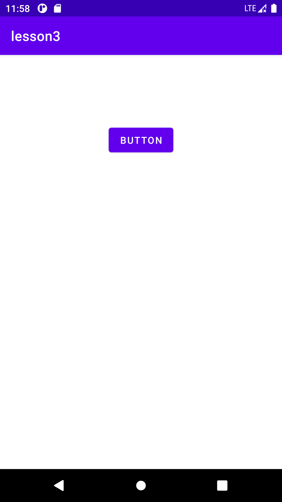

# lesson3

## 简介

Actvity入门实验

- Activity
- Intent
- LinearLayout
- Button、TextView
- Log

功能模块

- 通过IDE创建新的Activity
- 手动创建Activity类
- 了解Activity的生命周期
- 创建部局文件，使用基础的UI布局和控件
- 完成2个Actvitiy之间跳转并传递数据

## 截图

