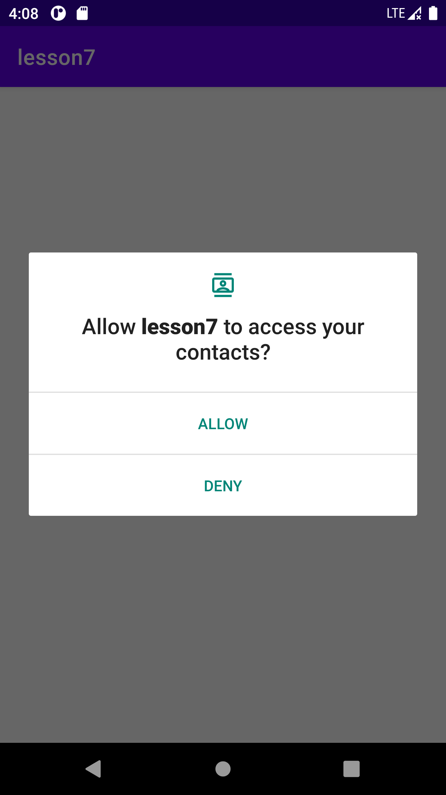
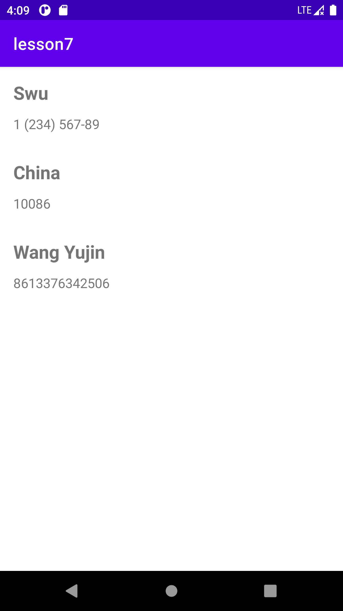
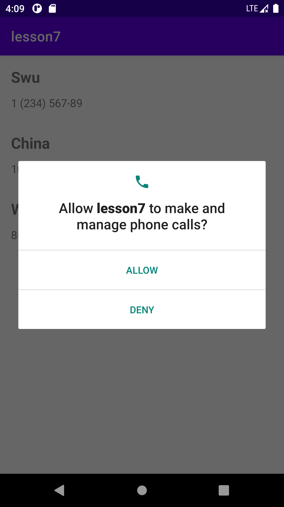
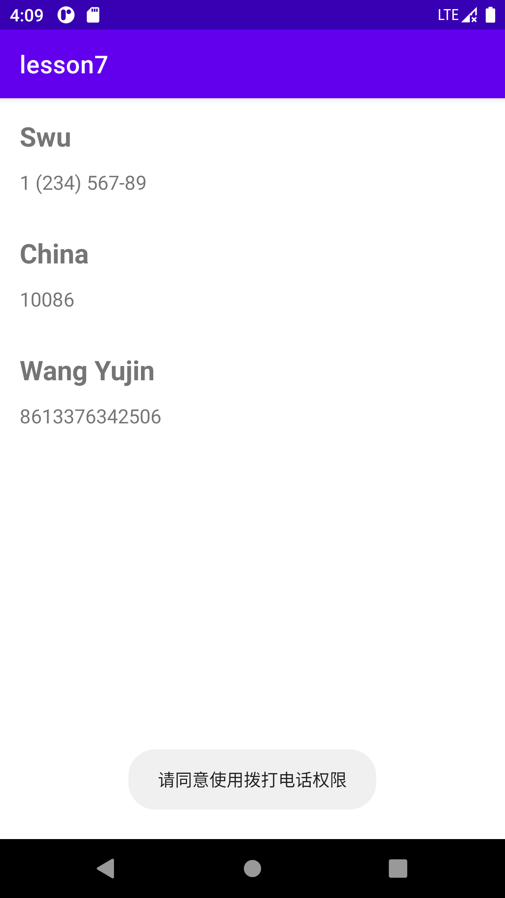

# lesson7

## 简介

使用ContentResolver读写联系人，并构建属于自己的联系人管理应用

- 运行时权限
- ContentProvider
- ContentResolver

功能模块

- 使用运行时权限
- 使用contentResorlver读写数据
- 支持拨打电话

## 截图

#### 通讯录中的联系人

#### 申请访问联系人权限对话框

#### 用户拒绝了联系人权限申请

#### 用户同意联系人权限申请后，主界面

#### 申请访问拨打电话权限对话框

#### 用户拒绝了拨打电话权限申请

#### 拨打电话界面

