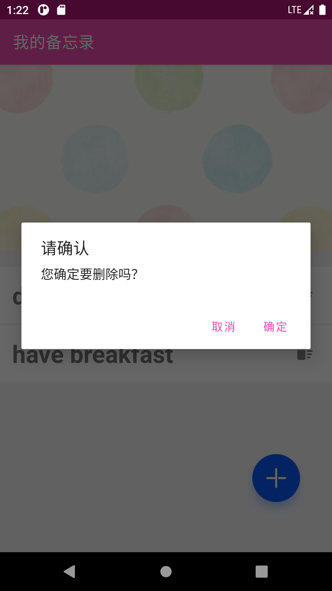

# Todolist

## 简介

使用Sqlite数据库完成一个类TODO应用

- Sqlite

功能模块

- 每条记录的内容由标题和内容组成 
- 主页面展示了当前备忘录中存储的所有待办事项的标题
- 点击标题后面的垃圾桶图标表示想要删除当前记录，在弹出的对话框中选择确定即可删除当前记录，点击取消则放弃删除 
- 点击主页面右下角的加号可以进入编辑页面，输入标题和内容后点击“保存”按钮，即可保存新的待办事项 
- 在主界面单击某条待办事项也可以进入编辑界面，编辑界面展示当前记录的内容，在输入框中修改，点击保存，即可实现待办事项的修改 
- 在编辑界面点击“清空”按钮可将标题和内容输入框的内容清空 
- 在编辑界面点击左上角的返回图标即可返回主界面，此时主界面内容为更新后的内容

## 截图

#### 首页初始状态

#### 添加待办事项

#### 点击“保存”，显示添加成功

#### 点击“清空”，清空标题和内容输入框

#### 已有两条待办事项的首页

#### 点击删除按钮

#### 删除成功

#### 点击某个待办事项查看详情

#### 修改待办事项标题和内容

#### 修改成功
